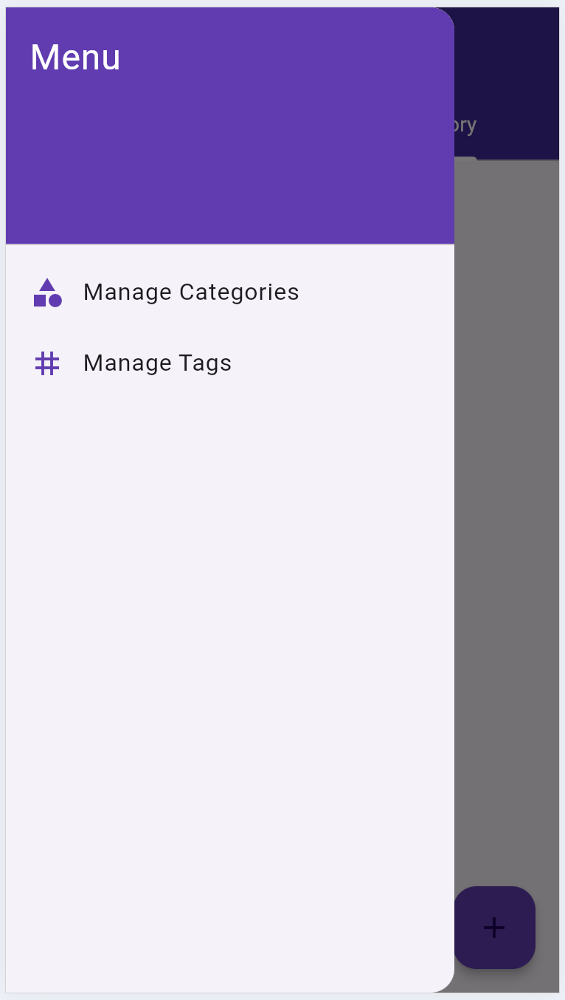

# expense_app

A new Flutter project.

## Introduction

Welcome to this practice project, where you will develop an Expense Management application using Flutter. This project helps you apply the skills and knowledge acquired throughout the course.

This hands on practice is a part of IBM iOS and Android Mobile App Developer Professional Certificate

In this final project, you will build a time tracking app using Flutter. This app will allow users to track the time spent on various tasks and projects. The data will be saved locally, ensuring that entries are not lost when the app is closed and reopened.  

The application you create will allow the user to manage their expenses with a friendly and intuitive user experience (UX). You will implement various essential features for an expense management app, such as adding, viewing, filtering, and deleting expenses.

Additionally, you will ensure that the data persists locally so that the user's expenses are not lost when the app is closed and reopened. We will use local storage for this feature.

## User stories

“I want to view a list of all my expenses to see my spending history at a glance.”
“I want to add an expense with a payee, amount, notes, date, category, and tag to keep track of my spending.”
“I want to save my expenses locally so I do not lose them when I close and reopen the app.”
“I want to group my expenses by category to see how much I spend in different areas.”
“I want to delete an expense to remove any incorrect or unnecessary entries.”
“I want to manage categories and tags in the app settings.”

## Objectives

After completing this practice project, you will be able to:

Create an intuitive UX for the user to list expenses
Give the user a way to add and delete expenses
Give the user a way to manage categories and tags
Implement CRUD operations for expense data
Integrate local storage to save data persistently

## Screens

Explore screens

        

